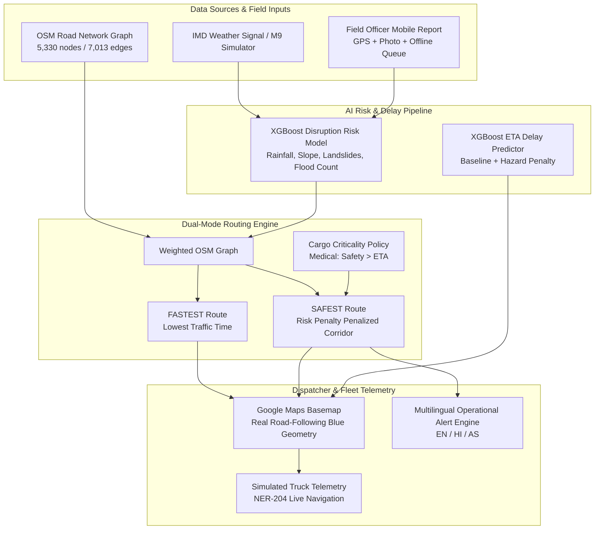

# SURAKSHA — AI-Powered Logistics & Accessibility Intelligence Platform for the North Eastern Region (NER)

**SIH Problem Statement ID:** 26002

---

## 📌 Executive Summary & Problem Statement

In the North Eastern Region (NER) of India, severe weather (monsoon heavy rainfall, flash floods, landslides) and steep terrain frequently disrupt critical supply chains. Emergency medical shipments, essential food supplies, and industrial logistics face sudden road closures, unpredicted delays, and severe hazards along mountain corridors (e.g. Guwahati–Silchar–Aizawl).

**SURAKSHA** predicts logistics disruptions before they become failures, evaluates real road routes against those risks using dual-mode routing (`FASTEST` vs `SAFEST`), and recommends safer routes while keeping emergency deliveries and field teams informed in real time.

---

## 🌐 LIVE PRODUCTION DEPLOYMENT

- **Live Production Frontend**: [https://suraksha-9pfb.onrender.com](https://suraksha-9pfb.onrender.com)

### Required Environment Variables

#### Frontend (Render / Local `.env`)
- `VITE_API_URL`: Backend API base URL (e.g. `https://suraksha-backend.onrender.com/api` or `http://127.0.0.1:8000/api`)
- `VITE_GOOGLE_MAPS_API_KEY`: Google Maps JavaScript & Routes API Key

#### Backend (Render / Local Environment)
- `SURAKSHA_AUTH_SECRET`: Secret key for JWT signing
- `SURAKSHA_ALLOWED_ORIGINS`: Comma-separated CORS allowed origins (e.g. `https://suraksha-9pfb.onrender.com,http://localhost:5173`)

### 🔑 Required Google Cloud Console Setup

To ensure Google Maps loads properly without rejection on production domains:
1. **Enable Google Cloud APIs**:
   - **Maps JavaScript API**
   - **Routes API**
2. **Billing Account**: Verify an active Google Cloud Billing Account is attached to the project.
3. **Application Restrictions**: Set to **Website / HTTP referrers**.
4. **Authorized HTTP Referrers**:
   - `http://localhost:5173/*`
   - `http://127.0.0.1:5173/*`
   - `https://suraksha-9pfb.onrender.com/*`

### 🗺️ Automatic Google Maps → SURAKSHA Local Map Fallback
- **Primary Provider**: Google Maps JavaScript API with traffic-aware Routes API.
- **Deterministic Fallback**: If Google Maps initialization fails (unauthorized domain, missing billing, network drop, or API error), SURAKSHA automatically switches to the **SURAKSHA Local Demo Map**.
- **Unified State**: The fallback vector map consumes the exact same canonical state (`origin`, `destination`, `fastestRoute`, `safestRoute`, `activeRoute`, `incidents`, `trucks`) with zero page reloads or UI resets.

### 🌤️ Live Weather API Integration
- **Provider**: Open-Meteo (Backend Proxy `/api/weather`)
- **Features**: Fetches live temperature, rainfall (mm), and wind speed for active mission coordinates.
- **Demo Alignment**: Live weather provides real-time operational context, while the M9 simulation remains available for controlled hazard escalation testing during SIH demonstrations.

---

## 🏗️ Architecture & Pipeline Overview



---

## 🚀 Technical Core Capabilities

1. **Google Maps & OSM Network Integration**: Renders real road-following polylines over Google Maps using OpenStreetMap graph coordinates.
2. **Explainable AI Assessment**: Breaks down disruption risk into 5 explicit feature factors (24h Rainfall, Slope/Terrain, Flood Exposure, Historical Landslides, Road Condition) with calibrated `Risk Probability`.
3. **Cargo-Aware Routing Policy**: Dynamically adjusts risk penalties based on cargo criticality:
   - **Medical Supplies**: Safety > ETA (`maxAcceptableExtraTimePercent: 80%`)
   - **Food & Essentials**: Balanced Safety/ETA (`maxAcceptableExtraTimePercent: 40%`)
   - **Construction Material**: Efficiency & ETA (`maxAcceptableExtraTimePercent: 20%`)
   - **General Cargo**: Standard Policy
4. **Mobile Field Incident Reporting & Offline Support**: Allows field officers to report landslides, floods, and road blockages. Includes an offline queue (`localStorage`) with automatic reconnection sync when back online.
5. **Multilingual Alerts**: Operational alerts and recommendations translated into **English**, **Hindi (हिंदी)**, and **Assamese (অসমীয়া)**.
6. **Simulated Telemetry**: Vehicle tracking along actual route geometry with live status updates (`EN ROUTE`, `DELAYED`, `ARRIVED`).

---

## 🎬 60–90 Second Competition Demo Sequence

- **STEP 1 (Start Mission)**: Dispatcher selects Emergency Medical Delivery (Guwahati $\rightarrow$ Aizawl) for truck `NER-204` with Critical Priority.
- **STEP 2 (Calculate Routes)**: System computes and displays **FASTEST** vs **SAFEST** options.
- **STEP 3 (Start Vehicle)**: Truck marker begins navigating along actual route geometry.
- **STEP 4 (Explainable AI)**: Review SURAKSHA AI Assessment breakdown (Rainfall, Slope, Landslide history).
- **STEP 5 (Trigger M9 Simulation)**: Click `[ SIMULATE WEATHER DETERIORATION ]`.
- **STEP 6 (Risk Increase)**: M9 system increases disruption risk on primary corridor (NER-R002) to 92%.
- **STEP 7 (Alert Triggered)**: Critical operational alert appears: `⚠ HIGH DISRUPTION RISK`.
- **STEP 8 (Re-evaluate Routes)**: SURAKSHA re-scores corridors under Medical Cargo safety policy.
- **STEP 9 (Recommendation)**: SURAKSHA recommends switching to `SAFEST ROUTE`.
- **STEP 10 (Reroute)**: Click `[ USE SAFEST ROUTE ]`. Map updates immediately to safer bypass.
- **STEP 11 (Delivery Continues)**: Truck `NER-204` continues along the new geometry with updated ETA.
- **STEP 12 (Field Officer Report)**: Open Field Incident Report modal, submit a Landslide report with photo/GPS. Appears on map and syncs cleanly.

---

## 🛠️ How to Run Locally

### 1. Backend (FastAPI)
```bash
cd backend
python -m uvicorn main:app --host 127.0.0.1 --port 8000
```
- **Health Check**: `GET http://127.0.0.1:8000/api/health`
- **Predict Risk**: `POST http://127.0.0.1:8000/api/predict-risk`

### 2. Frontend (React + Vite)
```bash
cd frontend
node node_modules/vite/bin/vite.js --host 127.0.0.1 --port 5173
```
- **Application URL**: `http://127.0.0.1:5173`

---

## 🧪 Testing & Verification

- **Backend Automated Tests**:
  ```bash
  pytest -q tests
  ```
  *(9 passed successfully)*

- **Frontend Production Build**:
  ```bash
  cd frontend
  node node_modules/vite/bin/vite.js build
  ```
  *(Built successfully in 1.86s)*

---

## 🛣️ Production Deployment Roadmap

- **Phase 1**: Pilot Fleet integration with state logistics departments in Assam and Mizoram.
- **Phase 2**: Real-time IMD Automated Weather Station (AWS) API integration.
- **Phase 3**: Border Roads Organisation (BRO) and PWD ground-truthing feed synchronization.
- **Phase 4**: Enterprise STQC / CERT-In security compliance & state-wide deployment.
